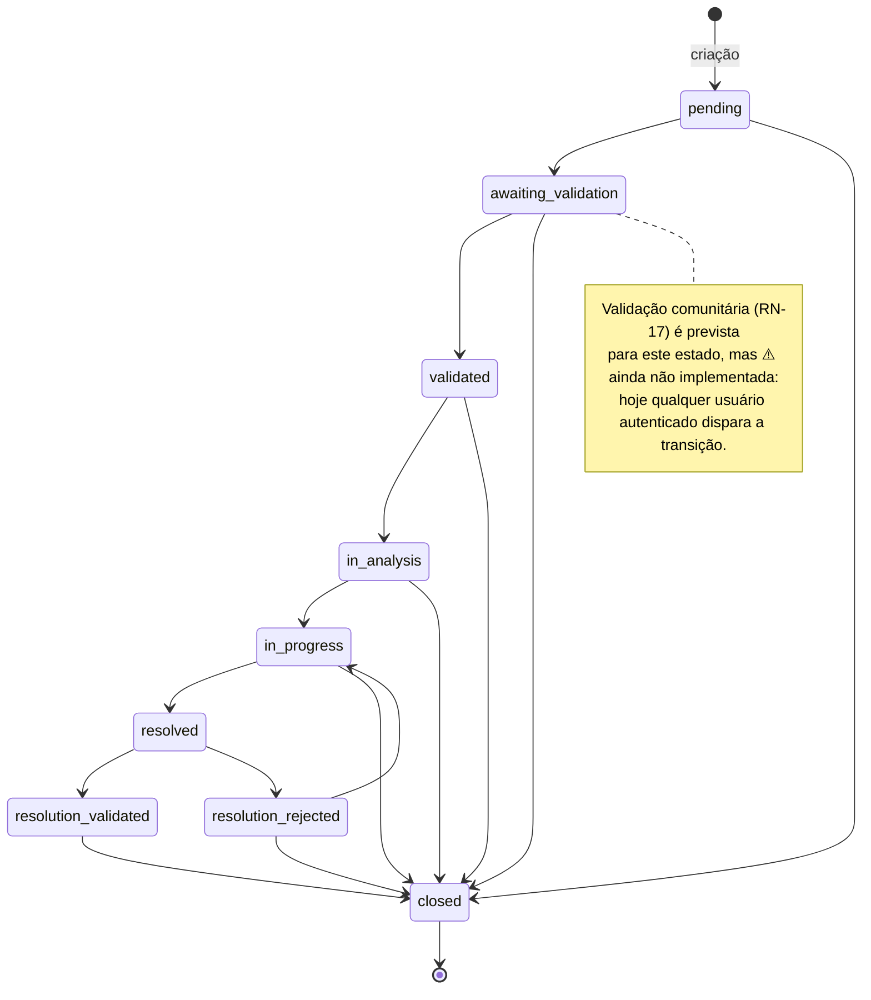

# 1. Regras de Negócio

> Cada regra diz **o que** impõe, **por que** existe e **onde** está implementada (arquivo/função).
> As regras foram extraídas de `src/services/`, `src/controllers/`, `src/middlewares/` e das
> funções PostGIS dos `src/models/`. Onde o código não confirma uma regra prevista no modelo de
> negócio, há um bloco `⚠️ A confirmar`.

## Índice de regras

| ID | Regra | Onde |
|----|-------|------|
| RN-01 | Login e identidade por CPF válido | `utils/cpf.js`, `services/authService.js` |
| RN-02 | Unicidade de e-mail e CPF no cadastro | `services/authService.js` |
| RN-03 | Geofencing — derivação do bairro pelo ponto | `services/occurrencesService.js`, `models/neighborhoodsModel.js` |
| RN-04 | Prevenção de duplicidade por raio geográfico | `services/occurrencesService.js`, `models/occurrencesModel.js` |
| RN-05 | Máquina de estados da ocorrência | `services/occurrencesService.js` |
| RN-06 | Trilha de auditoria de status (histórico) | `services/occurrencesService.js`, `models/occurrenceStatusHistoryModel.js` |
| RN-07 | Carimbo automático de `resolved_at` / `closed_at` | `models/occurrencesModel.js` |
| RN-08 | Reabertura / recorrência encadeada | `services/occurrencesService.js`, `models/occurrenceReopensModel.js` |
| RN-09 | Janela de edição da ocorrência | `utils/occurrenceEditWindow.js`, `services/occurrencesService.js` |
| RN-10 | Autorização de edição (autor ou admin) | `services/occurrencesService.js` |
| RN-11 | Votação (avaliações) e recálculo de score | `services/evaluationsService.js` |
| RN-12 | Bloqueio de voto em ocorrência fechada | `services/evaluationsService.js` |
| RN-13 | Integridade de mídias (allowlist, limites, CASCADE) | `config/storage.js`, `middlewares/upload.js`, `services/occurrenceMediaService.js` |
| RN-14 | Privacidade dos dados do cidadão (sanitização nas respostas) | `services/authService.js`, `utils/cpf.js` |
| RN-15 | Coerência categoria ↔ subcategoria | `services/occurrencesService.js` |
| RN-16 | Integridade referencial / operações destrutivas | schema (`db/`) |
| RN-17 | *(Roadmap)* Validação comunitária por elegibilidade | ⚠️ não implementada |

---

## RN-01 — Login e identidade por CPF válido

**O que:** o cadastro e o login usam o **CPF** como identificador de login. O CPF é normalizado
(apenas dígitos) e validado por formato (11 dígitos) e pelos **dois dígitos verificadores**;
sequências repetidas (`000…`, `111…`) são rejeitadas.

**Por que:** o CPF é a chave natural do cidadão perante a administração municipal; validar os
dígitos verificadores reduz cadastros inválidos/fraudulentos antes mesmo de consultar o banco.

**Onde:** `utils/cpf.js` (`normalizeCpf`, `isValidCpf`, `checkDigit`), consumido no fluxo de
`services/authService.js` (`login` busca o usuário por CPF normalizado).

**Comportamento:** CPF pode ser enviado com ou sem máscara. Credenciais inválidas ou usuário
inativo retornam **401 `INVALID_CREDENTIALS`** (mensagem genérica, sem revelar qual campo falhou).

---

## RN-02 — Unicidade de e-mail e CPF no cadastro

**O que:** no `POST /auth/register`, e-mail e CPF não podem já existir.

**Por que:** evita contas duplicadas para o mesmo cidadão.

**Onde:** `services/authService.js → register` (`findByEmail` → `EMAIL_ALREADY_REGISTERED` 409;
`findByCpf` → `CPF_ALREADY_REGISTERED` 409). A senha é protegida com **bcrypt** (`BCRYPT_SALT_ROUNDS`,
padrão 10) antes de persistir.

---

## RN-03 — Geofencing: derivação do bairro a partir do ponto

**O que:** ao criar uma ocorrência, se `neighborhood_id` **não** for informado, o bairro é
derivado da localização por **point-in-polygon** (`ST_Contains(boundary, ponto)`) sobre as
fronteiras dos bairros. Fica `null` se o ponto não cair em nenhum bairro cadastrado.

**Por que:** garante leitura por bairro ("Minha Cidade", analytics por bairro) sem exigir que o
cidadão escolha o bairro manualmente.

**Onde:** `services/occurrencesService.js → createOccurrence` (ramo `else`), apoiado em
`models/neighborhoodsModel.js → findByPoint` (SRID 4326, `ORDER BY id LIMIT 1` para
determinismo sobre divisas compartilhadas). A mesma base atende `GET /neighborhoods/locate`
(`neighborhoodsController.locate`).

> ⚠️ **A confirmar (divergência com o modelo de negócio):** o guia descreve geofencing como uma
> **restrição** que impede marcações fora do território de Videira. No código atual o geofencing
> **não bloqueia** a criação fora do município — apenas **deriva** o bairro (e deixa `null` fora
> dos polígonos). Não há validação que rejeite uma ocorrência fora dos limites municipais. Caso
> o bloqueio seja um requisito, ele precisa ser implementado (ver [Roadmap](./03-plano-de-projeto.md)).

---

## RN-04 — Prevenção de duplicidade por raio geográfico

**O que:** antes de persistir uma ocorrência, o sistema busca ocorrências da **mesma categoria**
num raio de **500 m** que **não estejam finalizadas** (`resolved`/`closed`). Se encontrar, rejeita.

**Por que:** reduz spam e relatos duplicados do mesmo problema.

**Onde:** `services/occurrencesService.js → createOccurrence`
(constante `ANTIDUPLICITY_RADIUS_M = 500`, lista `FINALIZED_STATUSES = ['resolved','closed']`).
A busca geográfica é `models/occurrencesModel.js → findNearby`, que usa
`ST_DWithin(location::geography, ponto::geography, raio)` e ordena por `ST_Distance`.

**Comportamento (bloqueio, não aviso):** em caso de duplicata, lança **409 `OCCURRENCE_DUPLICATE`**
com `details: { duplicate_id, distance_m }`. É um **bloqueio rígido** — a criação é abortada.

- O critério de duplicidade considera **categoria + raio + status não-finalizado**. Categorias
  diferentes no mesmo ponto **não** são duplicata.
- O endpoint `GET /occurrences/nearby` (raio configurável, padrão 500 m, máx. 50 km) usa a mesma
  base e serve a **visualização prévia** de ocorrências próximas no momento do registro.

---

## RN-05 — Máquina de estados da ocorrência

**O que:** o status da ocorrência só transita conforme uma máquina de estados fixa, validada no
servidor. `closed` é terminal.

**Por que:** distingue o ciclo de confirmação/validação do tratamento formal e impede saltos de
estado inválidos.

**Onde:** `services/occurrencesService.js` (`STATUS_TRANSITIONS`, `updateOccurrenceStatus`).
A entrada é validada no `controllers/occurrencesController.js → updateStatus`.

**Transições permitidas:**

```
pending              → awaiting_validation, closed
awaiting_validation  → validated, closed
validated            → in_analysis, closed
in_analysis          → in_progress, closed
in_progress          → resolved, closed
resolved             → resolution_validated, resolution_rejected
resolution_rejected  → in_progress, closed
resolution_validated → closed
closed               → (terminal)
```

> O valor `reopened` existe no enum `occurrence_status` do banco por **legado**, mas foi
> **descontinuado**: não é selecionável nem alvo de transição (a reabertura cria uma nova
> ocorrência — ver RN-08). A lista canônica de status (`OCCURRENCE_STATUSES`) deriva das chaves
> de `STATUS_TRANSITIONS`, então nunca inclui `reopened`.

**Comportamento:** uma transição não prevista lança **409 `INVALID_STATUS_TRANSITION`** com
`details: { from, to, allowed }`.

### Diagrama de estados (obrigatório)



> ⚠️ **A confirmar — quem dispara cada transição:** o modelo de negócio prevê que a **comunidade**
> conduz `awaiting_validation → validated` / `resolution_validated|rejected` e que o **órgão/admin**
> conduz os estados operacionais (`in_analysis → in_progress → resolved`). **No código atual,
> qualquer usuário autenticado pode disparar qualquer transição** — a rota
> `PATCH /occurrences/:id/status` exige apenas `auth`, sem `requireRole`. A segregação por papel é
> roadmap (ver [Perfis e Permissões](./04-perfis-e-permissoes.md) e [Roadmap](./03-plano-de-projeto.md)).

---

## RN-06 — Trilha de auditoria de status

**O que:** toda mudança de status (inclusive o estado inicial `NULL → pending` na criação) é
gravada em `occurrence_status_history` na **mesma transação** da mudança.

**Por que:** rastreabilidade completa do ciclo de vida e base para os indicadores de tempo de
resposta/resolução do módulo de analytics.

**Onde:** `services/occurrencesService.js` (`createOccurrence`, `updateOccurrenceStatus`,
`reopenOccurrence`) + `models/occurrenceStatusHistoryModel.js`. Consultável em
`GET /occurrences/:id/status-history`.

---

## RN-07 — Carimbo automático de `resolved_at` / `closed_at`

**O que:** ao entrar em `resolved`, `resolved_at` recebe `now()` (se ainda nulo); ao entrar em
`closed`, `closed_at` recebe `now()` (se ainda nulo).

**Por que:** marcos temporais confiáveis e idempotentes para SLA e analytics (não são
sobrescritos se o estado for revisitado).

**Onde:** `models/occurrencesModel.js → updateStatus` (`CASE WHEN … AND … IS NULL THEN now()`).

---

## RN-08 — Reabertura e recorrência

**O que:** uma ocorrência **resolvida ou fechada** pode ser reaberta via
`POST /occurrences/:id/reopen`. A reabertura **não altera** o status da original — cria uma
**nova ocorrência** (status `pending`) encadeada à anterior.

**Por que:** registra a **reincidência** de um mesmo problema preservando o histórico do ciclo
anterior, em vez de "ressuscitar" um registro encerrado.

**Onde:** `services/occurrencesService.js → reopenOccurrence`.

**Comportamento:**

1. A original é travada com `SELECT … FOR UPDATE` (serializa reaberturas concorrentes).
2. Só **estados finalizados** são reabríveis (`resolved`/`closed`); senão **409 `OCCURRENCE_NOT_REOPENABLE`**.
3. Só a **ponta da cadeia** pode ser reaberta: se a ocorrência já tem sucessora, retorna
   **409 `OCCURRENCE_ALREADY_REOPENED`** com `details.latest_occurrence_id`.
4. A nova ocorrência copia os dados da original (com overrides opcionais de
   título/descrição/endereço/localização), encadeia via `parent_occurrence_id`, mantém a
   `root_occurrence_id` (raiz do problema recorrente — a própria original, se ela ainda não tinha
   raiz) e incrementa `reopen_count`.
5. `assigned_organization_id` da nova ocorrência fica **nulo de propósito** (a reincidência passa
   por nova triagem).
6. Uma linha de auditoria é gravada em `occurrence_reopens` (`reason` é **obrigatório**).

Tudo (nova ocorrência + auditoria + histórico de status inicial) ocorre numa **única transação**.
O histórico de recorrência é consultável em `GET /occurrences/:id/reopens` (a partir de qualquer
ocorrência da cadeia, resolvido pela `root_occurrence_id`).

---

## RN-09 — Janela de edição da ocorrência

**O que:** os campos de uma ocorrência (e suas mídias) só podem ser alterados dentro de uma
janela de **24 h** a partir de `created_at` (configurável por `OCCURRENCE_EDIT_WINDOW_HOURS`).

**Por que:** depois de aberta e potencialmente em triagem, a ocorrência vira registro histórico;
edições tardias comprometeriam a confiabilidade do acompanhamento.

**Onde:** `utils/occurrenceEditWindow.js` (`isWithinEditWindow`, `assertWithinEditWindow`),
chamado em `services/occurrencesService.js → updateOccurrence` e no serviço de mídias.

**Comportamento:** fora da janela, edição retorna **403 `EDIT_WINDOW_EXPIRED`**.

---

## RN-10 — Autorização de edição (autor ou admin)

**O que:** apenas o **autor** da ocorrência ou um **admin** pode editar campos/mídias.

**Por que:** preserva a autoria do relato.

**Onde:** `services/occurrencesService.js → assertCanEdit` (`FORBIDDEN` → 403).

> ⚠️ **A confirmar — exclusão sem checagem de autoria:** `DELETE /occurrences/:id` exige apenas
> `auth` e **não** chama `assertCanEdit` nem `requireRole` — qualquer usuário autenticado pode
> **excluir qualquer ocorrência**. Isso é inconsistente com RN-10 (edição restrita) e está
> listado como correção no [Roadmap](./03-plano-de-projeto.md).

---

## RN-11 — Votação (avaliações) e recálculo de score

**O que:** cada usuário tem **no máximo um voto** por ocorrência (`up` ou `down`). Votar de novo
no mesmo sentido é idempotente; votar no sentido oposto **troca** o voto. `upvote_count`,
`downvote_count` e `score = upvotes − downvotes` são **recalculados na mesma transação**.

**Por que:** indicador de relevância/apoio da comunidade a uma ocorrência, consistente sob
concorrência.

**Onde:** `services/evaluationsService.js` (`voteOnOccurrence`, `removeUserVote`,
`recomputeOccurrenceCounts`; trava a ocorrência com `FOR UPDATE`). Unicidade
usuário×ocorrência garantida no schema de `evaluations`.

> ⚠️ **A confirmar (divergência):** o modelo de negócio prevê que a votação **prioriza demandas**.
> Hoje o `score` é apenas exibido/contabilizado; **não há fila de priorização automática** nem
> ordenação por score nos endpoints de listagem (que ordenam por `created_at DESC`).

---

## RN-12 — Bloqueio de voto em ocorrência fechada

**O que:** não é possível votar em uma ocorrência com status `closed`.

**Por que:** demandas encerradas não competem mais por priorização/atenção.

**Onde:** `services/evaluationsService.js → voteOnOccurrence` (→ **409 `OCCURRENCE_CLOSED`**).
Observação: o bloqueio é **apenas** para `closed`; ocorrências `resolved` ainda aceitam voto.

---

## RN-13 — Integridade de mídias

**O que:** uploads de mídia passam por **allowlist de mimetypes**
(`image/jpeg,image/png,image/webp,image/gif` por padrão — **SVG fica de fora de propósito**,
risco de XSS), limite de tamanho por arquivo (`MAX_UPLOAD_MB`, padrão 10) e de quantidade
(`MAX_UPLOAD_FILES`, padrão 5). O nome de arquivo é **gerado pelo servidor** (o nome original
nunca entra no caminho de disco).

**Por que:** segurança (evita execução/serving de conteúdo perigoso e path traversal) e controle
de armazenamento.

**Onde:** `config/storage.js`, `middlewares/upload.js` (multer), `services/occurrenceMediaService.js`.
Ao excluir a ocorrência, as linhas de `occurrence_media` caem em **CASCADE** e os **arquivos em
disco** são removidos explicitamente (as chaves são coletadas antes do DELETE). Erros: **413**
(tamanho), **415** (mimetype), **400** (campo inesperado / sem arquivos).

---

## RN-14 — Privacidade dos dados do cidadão

**O que:** `password_hash`, `cpf`, `refresh_token`, `reset_token` e `reset_token_expires_at`
**nunca** são retornados nas respostas da API.

**Por que:** LGPD/privacidade — minimização de exposição de dados pessoais e sensíveis.

**Onde:** `services/authService.js → sanitize` (desestrutura e descarta os campos sensíveis
antes de responder). Há também `utils/cpf.js → maskCpf` para exibição mínima quando estritamente
necessário (`***.***.789-**`). Os endpoints públicos de analytics expõem **apenas agregados**
(sem PII).

---

## RN-15 — Coerência categoria ↔ subcategoria

**O que:** ao criar uma ocorrência com `subcategory_id`, a subcategoria deve **pertencer** à
`category_id` informada.

**Por que:** evita combinações categoria/subcategoria incoerentes.

**Onde:** `services/occurrencesService.js → createOccurrence`
(`SUBCATEGORY_CATEGORY_MISMATCH` → 400; categoria/subcategoria inexistentes → 404).

---

## RN-16 — Integridade referencial e operações destrutivas

**O que:** FKs sensíveis governam o comportamento em deleções. Em especial, a remoção de uma
ocorrência apaga em **CASCADE** suas mídias (`occurrence_media`); reimportações de bairros devem
ser **aditivas** para não nulificar/órfãos referências de ocorrências.

**Por que:** evitar perda silenciosa de vínculos geográficos e registros órfãos.

**Onde:** schema restaurado de `db/init/zup_backup.backup` — DDL **verificado** via
`pg_restore --schema-only`. Ações de FK confirmadas (tabela completa em
[Modelo de Dados §7.4](./07-modelo-de-dados.md)):

- ✅ **`occurrences.neighborhood_id` → `ON DELETE SET NULL`** — confirma a regra: reimportações de
  bairros **devem ser aditivas** (uma remoção destrutiva zera o vínculo das ocorrências).
- ✅ `occurrences.category_id` / `subcategory_id` → **`RESTRICT`** (origem do **409** ao excluir
  categoria em uso).
- ✅ `occurrence_media`, `evaluations`, `occurrence_status_history` (occurrence) → **`CASCADE`**.
- ✅ `occurrences.author_id` → **`CASCADE`** (excluir um usuário apaga suas ocorrências — atenção em
  operações destrutivas de usuários).

> **Recomendação (R-10):** versionar o DDL em texto (`db/schema.sql`, sem as tabelas de staging)
> para fixar e auditar essas constraints sem depender do dump binário — ver
> [Roadmap](./03-plano-de-projeto.md).

---

## RN-17 *(Roadmap)* — Validação comunitária por elegibilidade

> ⚠️ **A confirmar / não implementada.** O modelo de negócio do ZUP prevê:
>
> - **Elegibilidade:** uma ocorrência em `awaiting_validation` seria confirmada por **cidadãos
>   elegíveis do mesmo bairro/região** antes de avançar.
> - **Seleção de validadores:** baseada no bairro e em **adjacência** (`neighborhood_adjacency`).
> - **Quórum:** número mínimo de confirmações para promover `awaiting_validation → validated`.
>
> **Estado no código atual:** a **modelagem de dados da adjacência já existe** — a tabela
> `neighborhood_adjacency` está no schema (PK composta `(neighborhood_id, neighbor_id)`, CHECK de
> não-reflexividade e FKs `CASCADE`), porém **nenhum código a consulta**. **Falta toda a lógica
> de aplicação:** não há papel "Validador", nem critério de elegibilidade, nem contagem de quórum,
> nem uso da adjacência. A transição `awaiting_validation → validated` é hoje livre para qualquer
> autenticado (ver RN-05). Os parâmetros desta regra (raio/adjacência, quórum, critério de
> elegibilidade) precisam ser definidos pelo autor e implementados sobre a estrutura já existente.
