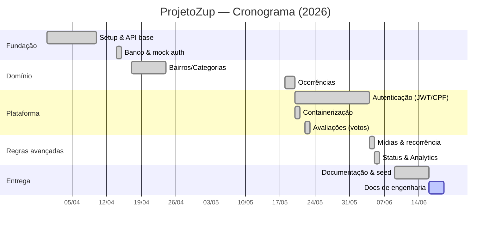

# 3. Plano de Projeto

## 3.1 Escopo e objetivos

**Objetivo geral:** disponibilizar uma plataforma cívica de **Zeladoria Urbana Participativa**
para o município de **Videira (SC)**, centralizando o registro georreferenciado e o
acompanhamento de problemas urbanos (buracos, iluminação, lixo, saneamento etc.) e aproximando a
população da administração municipal.

**Objetivos específicos:**

- Permitir o registro de ocorrências com **geolocalização** e **anexo de mídia**.
- Reduzir spam/duplicidade via **prevenção por raio geográfico** e visualização prévia de
  ocorrências próximas.
- Modelar o **ciclo de vida** da ocorrência com **máquina de estados** e trilha de auditoria.
- Registrar **reincidência/reabertura** de problemas.
- Oferecer **leitura por bairro** e **dashboards de transparência** (tempos, pendências, mapa de
  calor, eficiência por órgão).
- Garantir **segurança e privacidade** dos dados do cidadão (CPF, senha, tokens).

**Fora do escopo deste repositório:** o **frontend** (React + react-leaflet) é mantido em
repositório separado; aqui está o **backend** (API REST) e a infraestrutura de banco.

## 3.2 Equipe e responsabilidades

| Frente | Responsabilidade |
|--------|------------------|
| Backend / Banco | API Express em camadas, modelagem PostGIS, autenticação, analytics, Docker. |
| Frontend | Aplicação React, mapa Leaflet/OSM, telas e integração com a API. |

> ⚠️ **A confirmar:** nomes/divisão exata da equipe. Preencher conforme a organização do grupo.

## 3.3 Gestão de versão

- **Versionamento:** Git + GitHub, branch principal `main`.
- **Branches de feature:** o histórico mostra branches dedicadas (ex.: `featureReopen`,
  `featureMidias`) integradas por merge.
- **Rastreabilidade de issues:** commits encerram issues com keywords (`Closes #1`, `Closes #8`…),
  ligando entrega a backlog do GitHub.
- **Revisão:** fluxo de Pull Request para integração à `main`.

## 3.4 Cronograma / fases

Reconstruído a partir do histórico de commits (mar–jun/2026).

| Fase | Período | Entregáveis | Estado |
|------|---------|-------------|:------:|
| F1 — Setup & API base | 31/03 – 10/04 | Node, dependências, Express base | ✅ |
| F2 — Banco & mock auth | 14/04 | Inicialização do banco, `mockAuth` para testes | ✅ |
| F3 — Domínio base | 17/04 – 24/04 | Endpoints de bairros, categorias, subcategorias; coleção OpenAPI | ✅ |
| F4 — Ocorrências | 18/05 | CRUD de ocorrências + geolocalização | ✅ |
| F5 — Autenticação | 20/05 – 04/06 | `/auth` (JWT), usuários/perfil, **login por CPF** | ✅ |
| F6 — Containerização | 20/05 – 21/05 | Docker / Docker Compose (dev e prod) | ✅ |
| F7 — Engajamento | 22/05 | Avaliações (votos) e recálculo de score | ✅ |
| F8 — Mídias & recorrência | 04/06 | Upload de mídias, reabertura encadeada, janela de edição | ✅ |
| F9 — Status & analytics | 05/06 | Máquina de estados + histórico, slugs, **módulo de analytics**, validação de bairro, `/organizations` | ✅ |
| F10 — Documentação & seed | 09/06 – 16/06 | README, dump/seed do banco, **backup sanitizado** para repo público | ✅ |
| F11 — Documentação de engenharia | 16/06 | Esta pasta `docs/` (regras, requisitos, plano, permissões, ER, diagramas) | 🟡 em andamento |

### Gantt (Mermaid)

## 3.5 Marcos (milestones)

| Marco | Data | Critério de conclusão |
|-------|------|-----------------------|
| M1 — API navegável | 24/04 | Bairros, categorias e subcategorias respondendo via HTTP |
| M2 — Ocorrências georreferenciadas | 18/05 | Criar/listar ocorrências com PostGIS |
| M3 — Plataforma autenticada | 04/06 | Login por CPF, JWT, perfis e mídias |
| M4 — Transparência | 05/06 | Máquina de estados + dashboards de analytics |
| M5 — Pronto para demonstração | 16/06 | Backup sanitizado + README + seed reprodutível |
| M6 — Documentação de entrega | — | Pasta `docs/` revisada e aprovada |

## 3.6 Estado atual

**Pronto (✅):**
- Modelagem geoespacial dos bairros (fronteiras, ponto central) e geofencing por point-in-polygon.
- Schema das tabelas principais (usuários, ocorrências, mídias, histórico de status, reaberturas,
  avaliações, categorias/subcategorias, bairros, órgãos) restaurável via dump.
- Autenticação real por **CPF + JWT** (access/refresh) com recuperação de senha e rate limiting.
- Ocorrências: criação com anti-duplicidade e geofencing, edição com janela de 24 h, máquina de
  estados com histórico, reabertura encadeada, upload de mídias, votação.
- Módulo de **analytics** (RF-23 a RF-27) sobre views base (`v_occurrence_metrics`,
  `v_heatmap_points`).
- Containerização (Docker Compose dev/prod) e **backup sanitizado** para o repositório público.
- Documentação OpenAPI 3.0 (`openapi.json`).

**Em transição / parcial (🟡):**
- **Autorização por papel** nas transições e na exclusão: hoje várias ações operacionais exigem
  apenas `auth` (ver [Perfis e Permissões](./04-perfis-e-permissoes.md)).
- `mockAuth` (`USE_MOCK_AUTH`) ainda presente como atalho de desenvolvimento.

## 3.7 Roadmap / backlog

Itens decorrentes das divergências e lacunas levantadas na documentação:

| # | Item | Origem |
|---|------|--------|
| R-01 | **Validação comunitária** (papel Validador, elegibilidade por bairro, quórum) | RN-17 / RF-29 |
| R-02 | Algoritmo de seleção de validadores sobre a **`neighborhood_adjacency`** (tabela já existe; falta a lógica) | RN-17 |
| R-03 | **Segregar transições de status por papel** (`agent`/`admin` nos estados operacionais) | RN-05 / RF-12 |
| R-04 | **Restringir exclusão** de ocorrência a autor/admin (`DELETE /occurrences/:id`) | RN-10 |
| R-05 | Restringir, na criação, campos privilegiados (`status`, `assigned_organization_id`) | RF-06 |
| R-06 | **Geofencing como bloqueio** ao território de Videira | RN-03 / RF-31 |
| R-07 | **Priorização por votação** (ordenar/filtrar por `score`) | RN-11 / RF-30 |
| R-08 | **Notificações** ao autor em mudança de status | RF-32 |
| R-09 | Substituir `mockAuth` por fluxo real em todos os ambientes | F2/F5 |
| R-10 | **Migrations versionadas** + DDL em texto (`db/schema.sql`) com índices e FKs explícitos | RN-16 / RNF-01 |
| R-11 | **Testes automatizados** e **pipeline CI/CD** | RNF (lacuna) |
| R-12 | Versionar o SQL das views de analytics (`db/analytics_views.sql`) | analytics |
| R-13 | Rate limiter dedicado e cache/TTL nos endpoints públicos de analytics | analytics |
| R-14 | Remover tabelas de staging (`bairros_raw`, `staging_bairros_sc`) do backup público | §7.2 |

> A priorização recomendada para a próxima iteração concentra-se em **segurança de autorização**
> (R-03, R-04, R-05) e **fixação do schema** (R-10), por serem pré-requisitos para confiabilidade
> da entrega, antes dos recursos comunitários (R-01/R-02).
