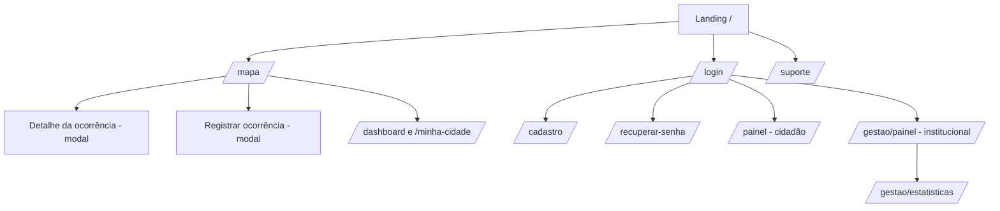

# 6. Documentação Técnica do Frontend

O frontend é mantido em **repositório separado** e consome esta API REST como fonte da verdade.
Esta seção descreve a aplicação real desse repositório.

> 🔗 **Repositório do frontend:** <https://github.com/Grogww/ProjetoZupFront>
> (aplicação **ZUP X — Zeladoria Urbana Participativa**, React + Vite + TypeScript).

## 6.1 Stack

- **React 18** + **TypeScript** + **Vite 5** (`@vitejs/plugin-react-swc`).
- **React Router** (`react-router-dom`) para rotas; **TanStack Query** (`@tanstack/react-query`)
  para cache e estado de servidor.
- **Tailwind CSS** + **shadcn/ui** (componentes sobre **Radix UI**), **lucide-react** (ícones) e
  **framer-motion** (animações).
- **Leaflet** + **react-leaflet** + **leaflet.heat** para o mapa e o mapa de calor.
- **react-hook-form** + **zod** para formulários e validação.
- **Recharts** para gráficos de analytics; **sonner** para toasts; **react-helmet-async** para SEO.
- Build e deploy via **Docker** (`Dockerfile`, `nginx.conf`, `docker-compose.yml`).

## 6.2 Estrutura do projeto

```
src/
├── main.tsx            # Bootstrap (HelmetProvider) + CSS do Leaflet
├── App.tsx             # Providers (QueryClient, Theme, Tooltip, Auth) e rotas
├── pages/              # Uma página por rota (Index, MapPage, Dashboard, Login, Gestao…)
├── components/         # Componentes de domínio (MapView, ReportCard, StatusControl…)
│   ├── ui/             # Primitivos do shadcn/ui (Radix)
│   ├── layout/         # Navbar
│   └── support/        # Suporte/FAQ (FAB, formulário, footer)
├── hooks/              # useAuth, useOccurrences, useStats, useTaxonomy, useTheme…
├── lib/                # Cliente HTTP e módulos de API (auth, occurrences, analytics…)
├── data/               # Tipos e configs de domínio (status, órgãos, FAQ)
└── vendor/leaflet/     # CSS do Leaflet vendorizado
```

## 6.3 Rotas e telas

Rotas declaradas em `App.tsx` (React Router). Rotas protegidas passam por `ProtectedRoute`
(exige sessão; `requireInstitutional` restringe a perfis institucionais — ver §6.4).

| Rota | Página | Acesso | Consome (API) |
|------|--------|--------|---------------|
| `/` | Landing / início | público | — |
| `/mapa` | Mapa principal (ocorrências, calor, bairros) | público | `GET /occurrences`, `/neighborhoods`, `/categories`, `/analytics/heatmap` |
| `/dashboard` e `/minha-cidade` | Dashboards / transparência e recorte por bairro | público | `GET /analytics/*`, `/neighborhoods/:id/occurrences` |
| `/login` | Login por **CPF + senha** | público | `POST /auth/login`, `/auth/refresh` |
| `/cadastro` | Cadastro de cidadão | público | `POST /auth/register` |
| `/recuperar-senha` | Recuperação de senha | público | `POST /auth/forgot-password`, `/auth/reset-password` |
| `/painel` | Painel do cidadão (minhas ocorrências, votos, validações) | autenticado | `GET /occurrences?author_id=`, `/users/me`, votos |
| `/institucional/:type` | Painel institucional por órgão | institucional | ocorrências, status, analytics |
| `/admin` | Painel administrativo | institucional/admin | `GET /users`, categorias, analytics |
| `/gestao`, `/gestao/login` | Entrada da área de gestão | público / login | `POST /auth/login` |
| `/gestao/painel` | Triagem e andamento (mudança de status, atribuição) | institucional | `GET /occurrences`, `PATCH …/status` |
| `/gestao/estatisticas` | Estatísticas de gestão | institucional | `GET /analytics/*` |
| `/validacoes` | Redireciona para `/painel?tab=validations` | — | — |
| `/suporte` | Suporte / FAQ + contato | público | — |
| `*` | Página 404 | público | — |



> O **detalhe** e o **registro** de ocorrência são abertos como **modais**
> (`ReportDetailModal`, `CreateReportModal`) sobre o mapa, não como rotas próprias.

## 6.4 Papéis no frontend e mapeamento com o backend

O backend tem três papéis (`citizen | agent | admin`). O frontend trabalha com um modelo mais
rico de perfis e **órgãos** e faz a tradução em `lib/auth-api.ts → mapRoles`:

| Papel no backend | Perfil no frontend | Observação |
|------------------|--------------------|------------|
| `citizen` | `cidadao` | Acesso ao painel do cidadão. |
| `agent` | `prefeitura` (institucional) | O backend ainda **não vincula agente a um órgão**, então todo `agent` é tratado como Prefeitura. |
| `admin` | `admin` | Acesso institucional total. |

Os **órgãos** previstos na UI (`data/organConfig.ts`) são **Prefeitura**, **Água e Saneamento
(VISAN)** e **Energia e Iluminação (CELESC)**. Como a atribuição agente→órgão ainda não existe no
backend (ver [Roadmap R-04](./03-plano-de-projeto.md)), os dois últimos ficam preparados na UI mas
sem origem no servidor. O acesso institucional é decidido por `isInstitutional(roles)`
(`prefeitura`/`agua_saneamento`/`energia_luz`/`admin`).

## 6.5 Integração com a API (cliente)

Toda a comunicação passa por um cliente HTTP central (`lib/api.ts`):

- **Base da API:** lida de `import.meta.env.VITE_API_BASE_URL` (ex.: `http://localhost:3000/api`) —
  **nunca** há URL fixa no código.
- **Tokens:** `access`/`refresh` guardados em `localStorage` (`zup_access_token`,
  `zup_refresh_token`); o `access` é enviado como `Authorization: Bearer <token>`.
- **Refresh automático:** ao receber **401** numa rota autenticada, o cliente chama
  `POST /auth/refresh`, atualiza os tokens e **repete a requisição** uma vez (com de-duplicação de
  refreshes concorrentes). Se o refresh falhar, limpa a sessão.
- **Erros:** respostas de erro do backend (`{ error, details? }`) viram uma `ApiError` com
  `status` e `data`; a UI mapeia, p.ex., **409 `OCCURRENCE_DUPLICATE`** para o aviso de ocorrência
  próxima usando `details.duplicate_id`/`distance_m`.
- **Upload:** mídias enviadas como `multipart/form-data` no campo **`media`**
  (`POST /occurrences/:id/media`).

Os módulos de `lib/` espelham os contratos do backend e adaptam ao modelo do front:

- **Geometria:** `location` chega como **GeoJSON Point** (`coordinates: [lng, lat]`); o front
  converte para `{ lat, lng }`.
- **Status:** normalizados para os **9 status reais** da máquina de estados; valores fora da lista
  caem para `pending`.
- **Mídias:** URLs relativas são prefixadas com a origem do backend (`resolveMediaUrl`).
- **Prioridade:** o backend não tem campo de prioridade; o front assume um valor padrão até a
  **priorização por votação** (RN-16) existir.

### Status exibidos (rótulos)

| Status (API) | Rótulo na UI |
|--------------|--------------|
| `pending` | Pendente |
| `awaiting_validation` | Aguardando Validação |
| `validated` | Validada pela Comunidade |
| `in_analysis` | Em Análise |
| `in_progress` | Em Execução |
| `resolved` | Resolvido pelo Órgão |
| `resolution_validated` | Resolução Validada |
| `resolution_rejected` | Resolução Rejeitada |
| `closed` | Encerrada |

## 6.6 Camada de mapa (Leaflet / OSM)

`components/MapView.tsx` concentra o mapa:

- **Tiles do OpenStreetMap**; pins SVG coloridos por status (`getStatusColor`).
- **Contorno dos bairros** desenhado a partir do GeoJSON `boundary` (`useNeighborhoodBoundaries`),
  com estilo translúcido e `interactive: false` para o clique passar ao mapa.
- **Registro por clique:** no fluxo de criação, clicar no mapa define a localização da ocorrência;
  o bairro é resolvido por `GET /neighborhoods/locate` (geofencing do backend).
- **Pré-visualização de proximidade:** ocorrências próximas vêm de `GET /occurrences/nearby`
  (apoia a anti-duplicidade — RN-04).
- **Mapa de calor:** `leaflet.heat` sobre os pontos de `GET /analytics/heatmap`.

## 6.7 Identidade visual e UX

- **Paleta:** base clara com **primária em tons de roxo** (`--primary: 262 60% 45%`); cada órgão
  tem cor de destaque própria (Prefeitura roxo, VISAN azul, CELESC âmbar).
- **Tema claro/escuro** alternável (`useTheme`, variáveis CSS em `index.css`).
- **Componentes acessíveis** via shadcn/ui (Radix); toasts com **sonner**; formulários com
  **react-hook-form + zod**.
- **SEO** básico por página com `react-helmet-async` (`components/Seo.tsx`).
- **Suporte/FAQ** com FAB persistente (`components/support/SupportFab.tsx`).

## 6.8 Como rodar o frontend

1. `VITE_API_BASE_URL` no `.env` apontando para a API (ex.: `http://localhost:3000/api`).
2. `npm install` e `npm run dev` (Vite, porta padrão `5173`).
3. Build de produção: `npm run build`; o repositório também traz `Dockerfile` + `nginx.conf` para
   servir o build estático em container.

> Esses valores casam com o backend: `FRONTEND_URL` (padrão `http://localhost:5173`) e
> `FRONTEND_RESET_PATH` (`/reset-password`) são usados pelo backend para montar o link do e-mail de
> recuperação de senha — no front, a rota correspondente é `/recuperar-senha`.
