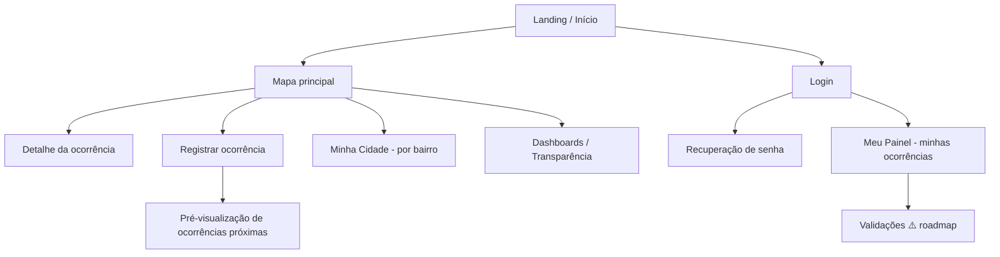

# 6. Documentação Técnica do Frontend

> ⚠️ **Importante:** o frontend **não faz parte deste repositório** (que contém apenas o backend).
> O conteúdo abaixo é **especificação de intenção**, derivada do modelo de negócio e das
> "pegadas" que o backend deixa para o cliente (variáveis, formatos de resposta, fluxos). Tudo o
> que não puder ser confirmado no repositório do frontend está marcado com `⚠️ A confirmar`.

## 6.1 Stack prevista

- **React** + **react-leaflet** com tiles do **OpenStreetMap**.
- Consumo da API REST deste backend (base `/api`), autenticação via **JWT** no cliente.

## 6.2 O que o backend já oferece ao cliente

Fatos verificáveis neste repositório, úteis para o frontend:

- **CORS** habilitado globalmente (`app.use(cors())`) — o front pode chamar a API de outra origem.
- Variáveis que pressupõem um front: `FRONTEND_URL` (padrão `http://localhost:5173`, típico de
  **Vite**) e `FRONTEND_RESET_PATH` (`/reset-password`) usadas para montar o link do e-mail de
  reset → o front precisa ter uma rota `/reset-password?token=…`.
- Geometria sempre em **GeoJSON** (`ST_AsGeoJSON`) — pronto para o Leaflet (bairros como polígono
  `boundary`, `center_point` como ponto, `location` da ocorrência como ponto).
- `GET /occurrences/:id` com **auth opcional** devolve `voted_user` (`up`/`down`/`null`) — permite
  destacar no front o voto do usuário logado.
- Mídias servidas em `GET /uploads/occurrences/<arquivo>` (somente leitura); a URL pode ser
  absoluta se `PUBLIC_BASE_URL` estiver setada, ou relativa.
- Endpoints de **analytics** públicos entregam agregados prontos para dashboards e o
  **mapa de calor** (`[{lat,lng,weight}]`).

## 6.3 Mapa de navegação / telas (especificação)

> ⚠️ A confirmar no repositório do frontend. Telas previstas no modelo de negócio:

| Tela | Endpoints que consome | Observação |
|------|-----------------------|------------|
| Landing | — | Apresentação da plataforma. |
| Login / Cadastro | `POST /auth/login`, `/register`, `/refresh` | Login por **CPF**. |
| Recuperação de senha | `POST /auth/forgot-password`, `/reset-password` | Rota `/reset-password?token=`. |
| Mapa principal | `GET /occurrences`, `/neighborhoods`, `/categories` | Filtros: bairro, categoria, status. |
| Registrar ocorrência | `GET /occurrences/nearby`, `POST /occurrences`, `POST …/media` | Mostrar próximas no raio antes de enviar (RN-04). |
| Detalhe da ocorrência | `GET /occurrences/:id`, `…/status-history`, `…/reopens`, votos | `voted_user` destaca o voto. |
| Minha Cidade | `GET /neighborhoods/:id`, `/neighborhoods/:id/occurrences` | Polígono do bairro no mapa. |
| Meu Painel | `GET /occurrences?author_id=`, `GET /users/me` | Minhas ocorrências. |
| Dashboards / Transparência | `GET /analytics/*` | KPIs, por bairro, heatmap, tempos. |
| Validações | ⚠️ roadmap (RN-17) | Depende de validação comunitária. |

## 6.4 Integração com a API (cliente)

- **Auth:** guardar `access_token` e `refresh_token`; enviar `Authorization: Bearer <access>`;
  ao receber **401** por expiração, tentar `POST /auth/refresh` e repetir a requisição.
- **Tratamento de erro:** respostas trazem `{ error, details? }` com HTTP coerente (ver
  [Backend §5.5](./05-backend.md)); o front deve mapear, p.ex., **409 `OCCURRENCE_DUPLICATE`**
  para um aviso "já existe ocorrência próxima" usando `details.duplicate_id`/`distance_m`.
- **Upload:** `multipart/form-data` campo `media` (até `MAX_UPLOAD_FILES`).

## 6.5 Camada de mapa (Leaflet/OSM)

> ⚠️ A confirmar. Itens esperados: tiles OSM; camada de **bairros** (GeoJSON `boundary`); camada de
> **ocorrências** (marcadores por `location`, ícone/cor da categoria); **raio de proximidade** no
> registro (círculo de 500 m + ocorrências de `/nearby`); **mapa de calor** a partir de
> `/analytics/heatmap` (filtro por `bbox` do viewport).

## 6.6 Identidade visual

> ⚠️ A confirmar. Paleta prevista: **branco + tons de roxo**; tipografia e padrões de UI a
> documentar no repositório do frontend. Responsividade em diferentes resoluções (RNF-usabilidade).

## 6.7 Gestão de estado e fluxo de dados

> ⚠️ A confirmar (biblioteca de estado, estrutura de componentes reutilizáveis, roteamento). Não
> verificável neste repositório.
