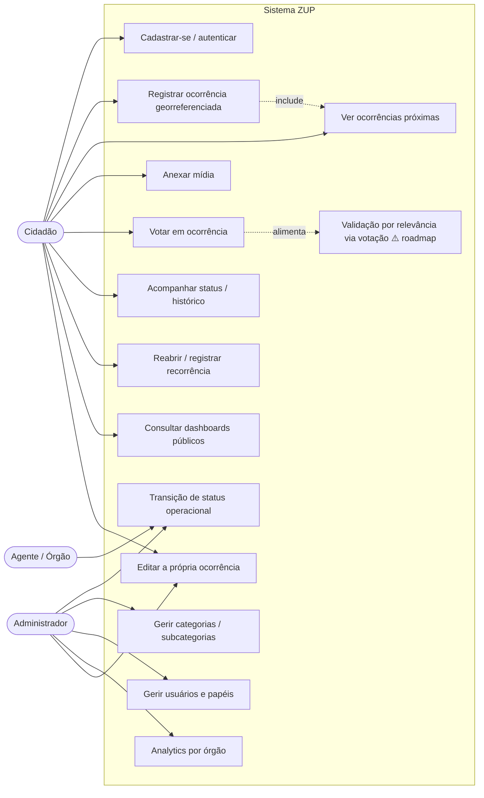
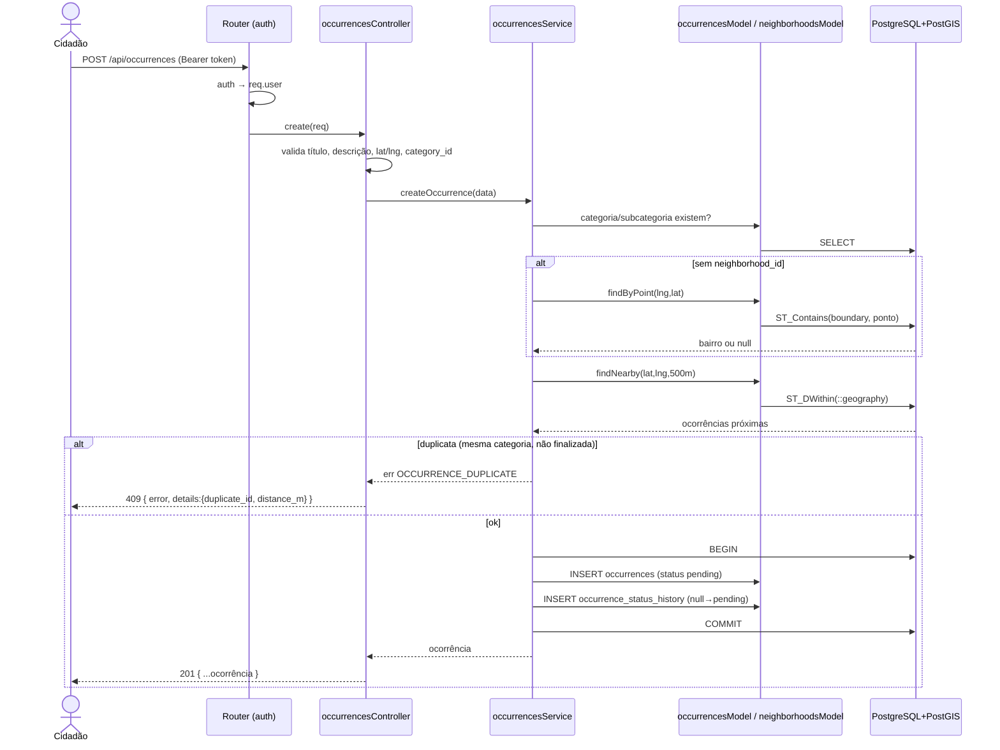
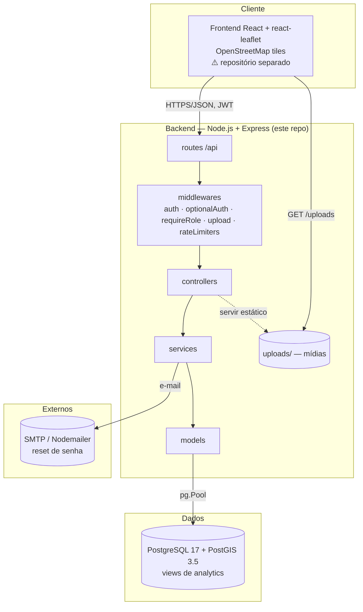
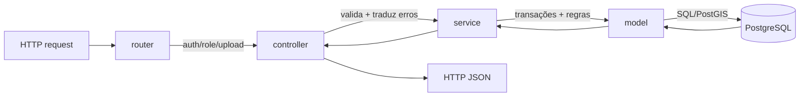

# 8. Diagramas (consolidados)

Todos em Mermaid. Os diagramas de **estados** e **ER** estão detalhados nas suas seções
([Regras §RN-05](./01-regras-de-negocio.md) e [Modelo de Dados §7.1](./07-modelo-de-dados.md));
aqui ficam os de **casos de uso**, **sequência** e **arquitetura**.

## 8.1 Casos de uso (atores × funcionalidades)



> ⚠️ Notas de fidelidade ao código: **UC10** (transição de status) hoje é acessível a **qualquer
> autenticado** (não apenas Agente/Admin) — ver [Perfis e Permissões](./04-perfis-e-permissoes.md).
> **UC14** (validação por relevância) é roadmap: será derivada automaticamente da votação dos
> cidadãos (RN-16), sem um papel "Validador" dedicado.

## 8.2 Sequência — registrar ocorrência (com anti-duplicidade e geofencing)



## 8.3 Sequência — ciclo de vida e reabertura

```mermaid
sequenceDiagram
    actor U as Usuário autenticado
    participant API as API
    participant DB as PostgreSQL

    U->>API: PATCH /occurrences/:id/status {status}
    API->>API: valida transição (STATUS_TRANSITIONS)
    alt transição inválida
        API-->>U: 409 {from,to,allowed}
    else válida
        API->>DB: BEGIN; UPDATE status e carimba resolved_at/closed_at; INSERT histórico; COMMIT
        API-->>U: 200 ocorrência
    end

    Note over U,DB: problema reincide após resolved/closed
    U->>API: POST /occurrences/:id/reopen {reason}
    API->>DB: SELECT ... FOR UPDATE (trava a original)
    alt não finalizada ou já reaberta
        API-->>U: 409 (NOT_REOPENABLE / ALREADY_REOPENED)
    else ok
        API->>DB: BEGIN; INSERT nova ocorrência pending encadeada e incrementa reopen_count; INSERT occurrence_reopens; INSERT histórico; COMMIT
        API-->>U: 201 nova ocorrência
    end
```

## 8.4 Arquitetura geral



### Arquitetura em camadas (request flow)



## 8.5 Diagramas referenciados em outras seções

- **Máquina de estados da ocorrência** → [Regras de Negócio §RN-05](./01-regras-de-negocio.md).
- **Diagrama ER do banco** → [Modelo de Dados §7.1](./07-modelo-de-dados.md).
- **Navegação do frontend** → [Frontend §6.3](./06-frontend.md).
